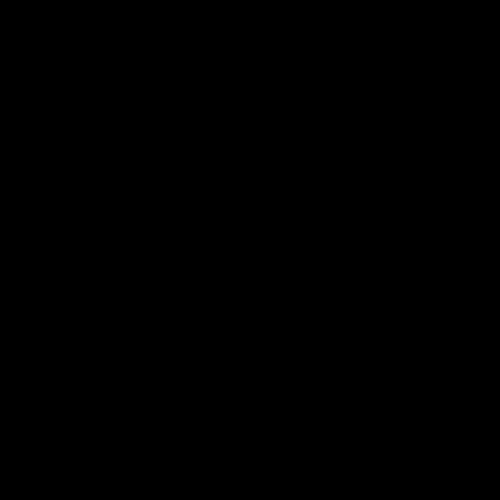

# Bullet Dodge
## A reinforcement learning environment

`bulletdodge.py` uses a vector observation consisting of the positions and velocities of both the agent and bullets.

`bulletdodge_pixel.py` uses a 2-channel pixel observation for the agent and bullets.